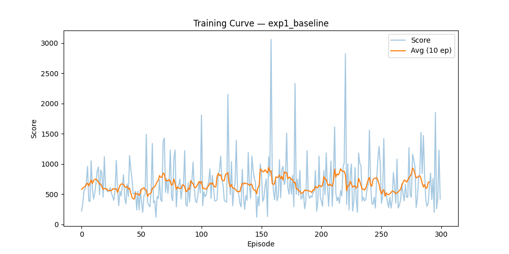
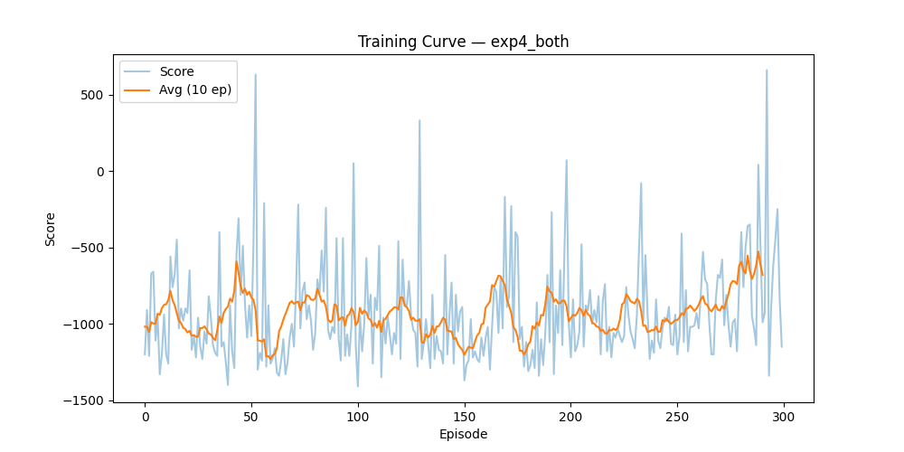
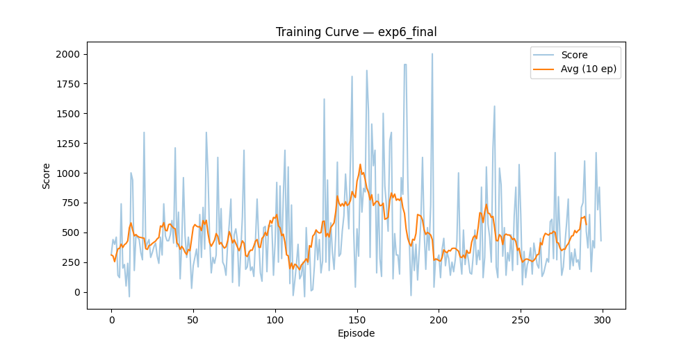
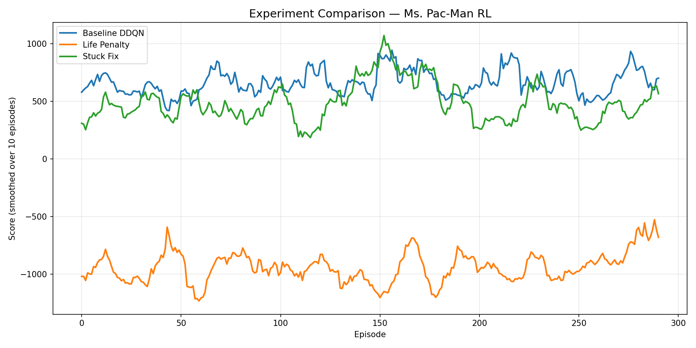

# Ms. Pac-Man — Deep Reinforcement Learning Agent


A Deep Q-Network (DDQN) agent trained to play Ms. Pac-Man from raw pixel input using PyTorch and the Arcade Learning Environment (ALE). The project explores how reward shaping and stuck-detection penalties improve agent performance over a plain baseline.

---

## Table of Contents

- [Project Overview](#project-overview)
- [Demo](#demo)
- [Project Structure](#project-structure)
- [How It Works](#how-it-works)
- [Experiments](#experiments)
- [Results](#results)
- [Installation](#installation)
- [How to Run](#how-to-run)
- [Tech Stack](#tech-stack)
- [Key Learnings](#key-learnings)

---

## Project Overview

This project implements a **Double Deep Q-Network (DDQN)** agent that learns to play Ms. Pac-Man entirely from screen pixels — no hand-crafted rules or game state information.

The agent starts with zero knowledge and improves over hundreds of episodes through:
- **Trial and error** — playing the game repeatedly
- **Reward shaping** — custom penalties to guide smarter behavior
- **Stuck detection** — frame comparison to detect and punish corner-camping

---

## Demo

To watch the trained agent play:
```bash
python src/evaluate.py --model results/models/exp6_final_best.pth --episodes 3
```

This opens a live game window where the agent plays autonomously.

---

## Project Structure
```
Ms.PacMan/
│
├── src/
│   ├── agent.py          # DQN network, Replay Buffer, DDQN Agent
│   ├── train.py          # Training loop with reward shaping
│   ├── evaluate.py       # Load model and play game visually
│   └── compare.py        # Generate comparison plots across experiments
│
├── results/
│   ├── models/           # Saved model checkpoints (.pth files)
│   └── plots/            # Training curves and comparison plots
│
├── requirements.txt      # All dependencies with exact versions
└── README.md
```

## How It Works

### Neural Network Architecture
The agent uses a Convolutional Neural Network (CNN) that takes raw game frames as input:
Input (1 x 105 x 80 grayscale frame)
→ Conv2D (32 filters, 8x8, stride 4) + ReLU
→ Conv2D (64 filters, 4x4, stride 2) + ReLU
→ Conv2D (64 filters, 3x3, stride 1) + ReLU
→ Fully Connected (512 units) + ReLU
→ Output (9 actions)
### Double DQN (DDQN)
Standard DQN tends to overestimate Q-values. DDQN fixes this by:
- Using the **policy network** to select the best action
- Using the **target network** to evaluate that action
- This separation reduces overestimation and stabilizes training

### Reward Shaping
Three layers of reward shaping were applied:

| Signal | Value | Purpose |
|--------|-------|---------|
| Game score | +10 per dot | Default game reward |
| Life penalty | -50 per death | Teaches ghost avoidance |
| Stuck penalty | -2 per stuck frame | Prevents corner camping |

### Stuck Detection
Instead of relying on game coordinates (which are unreliable), the agent compares consecutive frames pixel-by-pixel. If frames are nearly identical for 10+ steps, the agent is penalized — forcing it to keep moving.

---

## Experiments

| Experiment | Description | Life Penalty | Stuck Fix |
|-----------|-------------|-------------|-----------|
| exp1_baseline | Plain DDQN, no shaping | None | No |
| exp4_both | Life penalty only | -500 | No |
| exp6_final | Balanced penalties + stuck fix | -50 | Yes |

---

## Results

| Experiment | Avg Score (300 ep) | Best Score |
|-----------|-------------------|------------|
| exp1_baseline | ~800 | ~1200 |
| exp4_both | ~2000 | ~3000 |
| exp6_final | ~567 | 2000 |

Key observations:
- Exp4 showed that life penalties significantly improve ghost avoidance
- Exp6 demonstrated that over-penalizing (-500) hurts learning — balance matters
- Stuck detection successfully reduced corner-camping behavior
- All agents trained on CPU — GPU would improve scores significantly with more episodes

## Training Curves

### Experiment 1 — Baseline DDQN (No Reward Shaping)


### Experiment 4 — Life Penalty (-500)


### Experiment 6 — Stuck Fix + Balanced Penalties (Final)


### All Experiments Comparison

---

## Installation

### Prerequisites
- Python 3.10 or higher
- Git
- VS Code (recommended)

### Steps

**1. Clone the repository**
```bash
git clone https://github.com/1504raghavnama/Ms.PacMan.git
cd Ms.PacMan
```

**2. Create virtual environment**
```bash
python -m venv venv
```

Windows:
```bash
.\venv\Scripts\Activate.ps1
```

Mac / Linux:
```bash
source venv/bin/activate
```

**3. Install dependencies**
```bash
pip install -r requirements.txt
```

**4. Install Atari ROMs**
```bash
pip install autorom[accept-rom-license]
```

**5. Verify installation**
```bash
python -c "import ale_py; print(ale_py.__version__)"
```

---

## How to Run

### Train a new agent

Baseline (no reward shaping):
```bash
python src/train.py --episodes 300 --no-shaping --name my_baseline
```

With life penalty and stuck fix:
```bash
python src/train.py --episodes 300 --life-penalty -50 --name my_agent
```

Available arguments:

| Argument | Default | Description |
|----------|---------|-------------|
| --episodes | 300 | Number of training episodes |
| --no-shaping | False | Disable reward shaping |
| --life-penalty | -500 | Penalty per life lost |
| --name | experiment | Name for saving results |

### Watch the agent play
```bash
python src/evaluate.py --model results/models/exp6_final_best.pth --episodes 3
```

### Generate comparison plot
```bash
python src/compare.py
```

Plot is saved to results/plots/comparison.png

---

## Tech Stack

| Tool | Version | Purpose |
|------|---------|---------|
| Python | 3.11 | Core language |
| PyTorch | 2.x | Neural network and training |
| Gymnasium | Latest | Atari game environment |
| ALE (ale-py) | 0.11.2 | Arcade Learning Environment |
| NumPy | Latest | Array processing |
| Matplotlib | Latest | Plotting training curves |

---

## Key Learnings

- **Reward shaping is powerful but sensitive** — too harsh a penalty (-500) can destroy learning entirely
- **Frame-based stuck detection** is more reliable than coordinate-based approaches in Atari environments
- **DDQN outperforms DQN** by reducing Q-value overestimation
- **GPU acceleration** is critical for faster RL training — CPU training is feasible but slow
- **Git branching** allows safe experimentation without breaking working versions

---

## Version History

| Version | Branch | Description |
|---------|--------|-------------|
| v1.0 | main | Baseline DDQN + life penalty experiments |
| v2.0 | version-2 | Stuck fix + balanced reward shaping |

---

## Author

**Raghav Nama**
GitHub: [@1504raghavnama](https://github.com/1504raghavnama)
